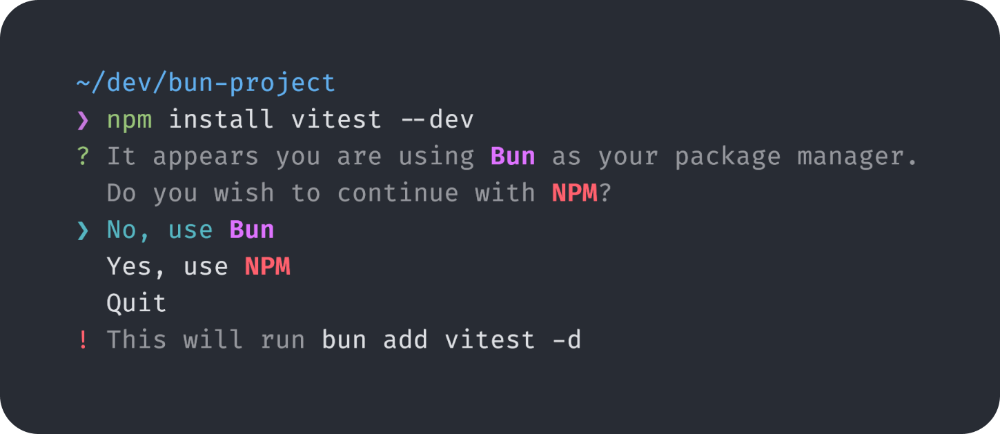

# `npm` Confirm (`npmc`)

> ✅ Use the right JS package manager without thinking.



## What is `npmc`?

`npmc` is a command line tool that prevents package manager mix-ups in your JS projects.

If you run a command with the wrong package manager, `npmc` will suggest the correct one and reformats the command for your package manager.

All commands that `npmc` may run are shown to you before they are executed, for full transparency.

You can choose to run the corrected command, stick with the original, or just cancel the operation.

Now, you can just copy and paste install code blocks from documentation without needing to change the package manager!

<details>
<summary>Why not `@antfu/ni`?</summary>

**TL;DR**: `npmc` saves you the hassle of needing to manually rewrite commands you copied... it just works running `npm` (and all other major package managers).

I believe that `@antfu/ni` is a great tool for what it does, but it does have a few limitations.

In order to use `ni`, you must modify installation commands that you typically copy from documentation. While it does save you the hassle of having to think of which package manager you're using, it still requires an extra step.

With `npmc`, you can just run the command directly, and have the tool suggest the corrected command for your package manager.

With this method, there's no thinking involved. Additionally, `npmc` shows you the commands that it's running, so you have full control over what you're doing, or not doing.

</details>

## Installation

```bash
npm install -g npm-confirm
```

This will expose a `npmc` command.

`npmc` is a wrapper for the `npm` command that confirms with you if it detects you using another package manager. 

I recommend aliasing `npmc` to just `npm`. For example, add this to your `.zshrc`:

```bash
alias npm='npmc'
```

<details>
<summary>Wrapping `pnpm`, `bun`, and `yarn`</summary>

You may also want the `pnpm`, `bun`, and `yarn` commands to give confirmation when used with the wrong package manager.

If you run `npmc` with the `--[NAME]-alias` flag, it will act as that package manager.

For example, if I run `npmc --pnpm-alias`, it will act as `pnpm` and confirm with you if you are using another package manager.

Similarly, you can add aliases for these commands in your `.zshrc`:

```bash
# npm
alias npm='npmc'

# pnpm
alias pnpm='npmc --pnpm-alias'

# bun
alias bun='npmc --bun-alias'

# yarn
alias yarn='npmc --yarn-alias'
```

Ensure the package manager you are wrapping is installed beforehand, or the user experience may be poor.

</details>


