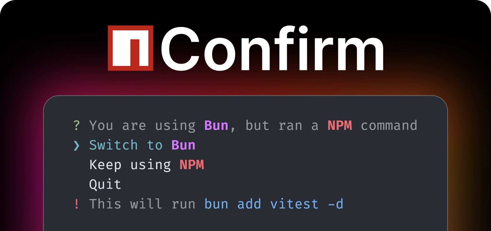

<p align="center">
Use the right JS package manager without thinking.
<br>
<a href="#installation">Installation</a> | <a href="#features">Features</a>
</p>

## What is `npmc`?

`npmc` is a wrapper for the `npm` command that _confirms with you if it detects you using another package manager_.

When confirming, you can choose to do 3 things:

1. Run your command, [**adapted for the new package manager**](#automatic-command-adaptation)
2. Run your **original command**
3. **Cancel** the operation

Now, you can just copy and paste `npm install` commands from documentation without needing to manually edit the package manager!

<details>
<summary>Why not <code>@antfu/ni</code>?</summary>

When aliased to just `npm`, `npmc` serves as a quick way to run commands copied from external sources without needing to modify it at all, as opposed to `ni`, which reqires you to still swap out the `npm install` bit.

However, these tools can serve as compliments.

- If you are typing commands directly, you can still choose to use `ni`.
- You can use `npmc` in addition for copying and pasting or to catch occasional slipups.

</details>

## Installation

```bash
npm install -g npm-confirm
```

This will give you access to the `npmc` command, which acts like the `npm` command, but confirms with you.

I strongly recommend aliasing `npmc` to just `npm` so you can use `npm` like normal.

To do this in `zsh` or `bash` add this to your `.zshrc` or `.bashrc`:

```bash
alias npm='npmc'
```

<details>
<summary>Wrapping <code>pnpm</code>, <code>bun</code>, and <code>yarn</code></summary>

You may also want the `pnpm`, `bun`, and `yarn` commands to give confirmation when used with the wrong package manager.

By default, `npmc` acts as `npm` when no other package managers are detected. However, you can change that default by simply passing a `--[NAME]-alias` flag.

For example, if I run `npmc --pnpm-alias`, it will act as `pnpm` and confirm with you if you are using a non-`pnpm` package manager.

Again, I recommend aliasing these in `.zshrc`:

```bash
# npm
alias npm='npmc'

# pnpm
alias pnpm='npmc --pnpm-alias'

# bun
alias bun='npmc --bun-alias'

# yarn
alias yarn='npmc --yarn-alias'
```

</details>

## Features

### Automatic Command Adaptation

`npmc` will automatically adapt agent subcommands and flags from one package manager to the other.

For example, NPM's `ci` command will automagically be converted to `bun install --no-save` for Bun, and accordingly for other package managers.

### Command Preview

`npmc` always shows you what command will be run, both when using the adapted package manager, or even the one you ran the command with.

This maximizes transparency, and ensures `npmc` never does something you didn't mean when adapting commands.

Have a problem with command adaptation? Submit an issue!

### Smart Confirmations

`npmc` only confirms when you run certain commands, such as `install`, `uninstall`, `run`, `upgrade`, and their variants for the various package managers. This means that when you truly meant to use the other package manager, `npmc` will not stand in your way. Furthermore, all global installations are directly done directly with whatever you ran it with!